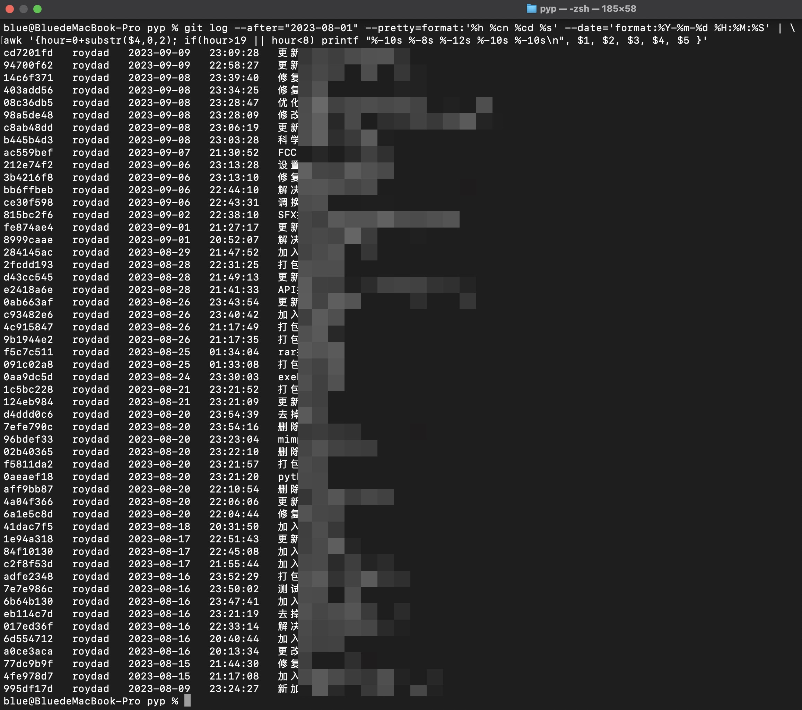

不知不觉，又熬夜了。
每个宁静的夜晚，打开电脑，面对五彩斑斓的代码，有种莫名的兴奋。  
刚开始的兴奋是因为：今天又有了一段可以安静思考的私人时间；  
熬完夜的兴奋是因为：看到刚开始未知无序的事情在代码的作用下顺理成章地运行。  

在互联网中遨游找答案时，无意间再次看到  [《雷军2023年度演讲》](https://finance.sina.cn/china/gncj/2023-08-15/detail-imzhfpkm5540368.d.html),  摘录几个关键词：   
- **99%的问题都有标准答案，找个懂的人问问  **  
- **敢想敢干**  
- **今天的社会，瞬息万变，光靠学校里学的知识肯定不够；只有养成终身学习的习惯，才能应对未来所有挑战。终身学习就是要靠自学能力。**    

我始终坚信，世界万物，都离不开逻辑因果关系，所有问题，都可以按顺瓜摸藤再找到根的逆向原理，先确定预期的目标，以最短实现路径，往前一步逆向分解出每一步的所有充分必要条件，逐级树型分解直到所有初级条件全部满足，那么问题自然就解决了。  
  
在互联网发达的今天，可以更容易地从世界各地、不同时代、不同文化文明沉淀中，找到到相同或相似的答案。学校教授的知识可能会落后于当前时代，但通过学校的教育经历，你必须学会如何思考，这样才能以不变应万变，以正确的思维方式加上好奇心驱使（兴趣），终身学习，实现一个又一个人生价值。  
  
说到人生价值，碳基人类寿命不过百年，在你失去生命体征的70年之后， 地球上再也找不到你曾经存在过的痕迹，太阳在50亿年之后，将会膨胀吞没一切碳基生命，到那时，宇宙重新回到混沌、沉寂。历史的车轮浩浩荡荡，生命如此，名与利、得与失更不值得一提。人生的价值在于和家人、知心朋友们在一起，保持健康的身体，不悲不喜，不骄不躁，感受美好的生活，仅此而已。  
  
借用莫言的语录 —— 做个 ***最好的人：像孩子一样真诚，像夕阳一样温暖，像天空一样宁静***。
  
*附录，近一个月的熬夜记录：*

